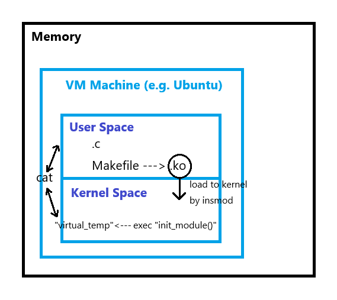

# Virtual Sensor

## 緣由
想了解 linux kernel module 基本的架構。

## 簡介
模擬某系統/硬體（e.g. GPU）的數據變化（e.g. 溫度），將隨機數值寫入到 /proc/ 底下（於 kernel space），使用者透過指令 call API 去該處讀取，並回傳到 user space 印出來。

## 架構


## 環境
VM with Ubuntu 24.04.2 LTS (Ubuntu Server)


## 常用指令

(make clean)

* 編譯：

    `make`

* 載入模組：

    `sudo insmod virtual_sensor.ko`

* 查看 kernel log，確認有成功載入：

    `dmesg | tail -n 20`

* 檢查 /proc 和 /sys 中的檔案：

    `cat /proc/virtual_temp_sensor`

    `cat /sys/kernel/virtual_sensor/temp`

    →註：每過五秒應該會看到一次溫度值更新。

* 卸載模組：

    `sudo rmmod virtual_sensor`

## 重點程式碼解釋

### 1. 定時器 callback：update_temp

```c=
static void update_temp(struct timer_list *t) {
    virtual_temp = get_random_u32() % 31;  // 產生 0~30 隨機溫度
    printk(KERN_INFO "Virtual Sensor: Temperature updated to %d\n", virtual_temp);
    mod_timer(&temp_timer, jiffies + msecs_to_jiffies(5000));  // 5 秒後再呼叫自己
}
```

* 用 kernel 提供的隨機函數模擬溫度變化。
* mod_timer 重新設定 timer 的到期時間。


### 2. proc 讀取函數：proc_read
``` c=
static ssize_t proc_read(struct file *file, char __user *buf, size_t count, loff_t *ppos) {
    char temp_str[16];
    int len = snprintf(temp_str, sizeof(temp_str), "%d\n", virtual_temp);
    return simple_read_from_buffer(buf, count, ppos, temp_str, len);
}
```
* 將目前溫度格式化成字串並傳回 user space。
* simple_read_from_buffer 處理用戶空間的 offset (ppos) 和緩衝區長度。
* 關鍵：當執行 cat /proc/virtual_temp_sensor 時：
    Linux 會透過 VFS（Virtual File System）找到透過 proc_create() 建立的對應 entry。（如果沒有寫 proc_read()，或沒有把它註冊給 /proc/virtual_temp_sensor，使用者執行 cat 時就會看到空白）

### 3. sysfs 讀取函數：temp_show
``` c=
static ssize_t temp_show(struct kobject *kobj, struct kobj_attribute *attr, char *buf) {
    return sprintf(buf, "%d\n", virtual_temp);
}
```
* sysfs 讀取時呼叫，將溫度寫入給 user space 的 buf。

### 4. 初始化函數：virtual_sensor_init
```c=
static int __init virtual_sensor_init(void) {
    // 建立 /proc/virtual_temp_sensor
    proc_entry = proc_create(PROC_NAME, 0444, NULL, &proc_fops);
    if (!proc_entry) return -ENOMEM;

    update_temp(NULL);  // 預先更新一次溫度

    timer_setup(&temp_timer, update_temp, 0);
    mod_timer(&temp_timer, jiffies + msecs_to_jiffies(5000));

    // 建立 sysfs kobject 和檔案
    sensor_kobj = kobject_create_and_add("virtual_sensor", kernel_kobj);
    if (!sensor_kobj) {
        remove_proc_entry(PROC_NAME, NULL);
        del_timer_sync(&temp_timer);
        return -ENOMEM;
    }
    if (sysfs_create_file(sensor_kobj, &temp_attr.attr)) {
        kobject_put(sensor_kobj);
        remove_proc_entry(PROC_NAME, NULL);
        del_timer_sync(&temp_timer);
        return -ENOMEM;
    }

    printk(KERN_INFO "Virtual Sensor: sysfs file created at /sys/kernel/virtual_sensor/temp\n");

    return 0;
}
```

* 建立 proc 入口與 sysfs 入口。
* 設定定時器。
* 錯誤發生時要清理資源。

### 5. 卸載函數：virtual_sensor_exit
```c=
static void __exit virtual_sensor_exit(void) {
    remove_proc_entry(PROC_NAME, NULL);
    del_timer_sync(&temp_timer);
    kobject_put(sensor_kobj);
    printk(KERN_INFO "Virtual Sensor: Module unloaded\n");
}
```
* 移除 proc 與 sysfs 檔案。
* 停止定時器。
* 釋放 kobject。